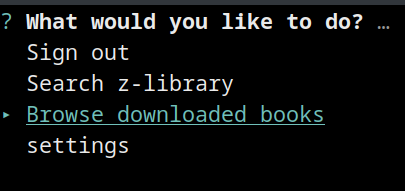

# ZLibrary CLI

# Installation

Installation can be done using `sudo npm install -g zlibrary-cli`

Run the CLI with: `zlib-cli`

supported systems: GNU/Linux with nodeJS 12+ installed

# Features
## Search
- Filtering by book name
- Filtering by release years of books
- Filtering by file extensions
- Filtering by language of book
## ZLibrary account systems
- Login
    - Login via email & password
    - Login via remix user tokens
- Signing up
- Logging out
- Personal domains
    - Update personal domain via settings
## Downloading
- Modify download directory via settings

# How does this work?
This CLI uses a reverse engineered version of the android api for ZLibrary. An unofficial documentation of the API can be seen here: https://github.com/baroxyton/zlibrary-eapi-documentation
